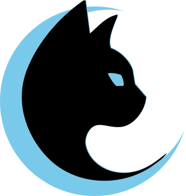

<div align="center">



# Luna

**Camera Report Generator for Filmsets**

A cross-platform DIT tool that ingests camera media, extracts metadata and thumbnails, and generates production-ready PDF and HTML camera reports.

[](LICENSE)


[Download](https://github.com/shakedex/LunaApp/releases/latest) · [Installation Guide](docs/INSTALLATION.md) · [Camera Support](docs/CAMERA_SUPPORT.md) · [Disclaimer](DISCLAIMER.md)

</div>

---

## What Luna Does

Luna is built for DITs and camera assistants. Point it at a card or a folder of clips and it will:

- Detect reels and group clips per camera roll
- Extract per-clip metadata (camera, lens, ISO, shutter, color space, frame rate, duration, …)
- Generate evenly-spaced thumbnails with accurate seeking
- Produce a clean, sharable PDF or HTML report
- Auto-update via Velopack

## Supported Cameras

| Family             | Status     | Notes                                                          |
| ------------------ | ---------- | -------------------------------------------------------------- |
| ARRI ALEXA         | Ready      | ARRIRAW (`.ari`), ProRes MXF/MOV — uses ARRI ART CLI           |
| Blackmagic BRAW    | Ready      | `.braw` — uses Blackmagic RAW SDK                              |
| Sony VENICE / FX   | Ready      | Sony RAW Viewer integration                                    |
| Generic (FFmpeg)   | Ready      | ProRes, H.264/265, DNxHD, and most container/codec combos      |

See [docs/CAMERA_SUPPORT.md](docs/CAMERA_SUPPORT.md) for the architecture and how to add a vendor.

## Install

Download a release for your platform:

| Platform   | Asset                                |
| ---------- | ------------------------------------ |
| Windows    | `Luna-X.X.X-win-x64-Setup.exe`       |
| macOS ARM  | `Luna-X.X.X-osx-arm64.dmg`           |

Full instructions including SmartScreen / Gatekeeper bypass: [docs/INSTALLATION.md](docs/INSTALLATION.md).

> Luna is not code-signed. The installer/app bundle is unsigned indie software — see the install guide for the standard "run anyway" steps.

### Vendor SDKs (optional, user-supplied)

Luna does **not** redistribute proprietary vendor SDKs. To enable a vendor's native pipeline, the user installs the SDK separately. See [DISCLAIMER.md](DISCLAIMER.md#third-party-sdks) for details.

| Vendor               | Component             | Where to obtain                  |
| -------------------- | --------------------- | -------------------------------- |
| ARRI                 | ART CLI (`art-cmd`)   | ARRI website (registration)      |
| Blackmagic Design    | Blackmagic RAW SDK    | Blackmagic Developer site        |
| Sony                 | Sony RAW Viewer       | Sony Pro support site            |

If a vendor SDK is missing, Luna degrades gracefully and emits a typed `UnsupportedFormatNotice` for those clips instead of dropping them silently.

## Build From Source

Requirements:

- .NET 10 SDK
- Windows 10 1809+ (x64) or macOS 12+ (Apple Silicon)

```bash
git clone https://github.com/shakedex/LunaApp.git
cd LunaApp
dotnet restore
dotnet build
dotnet run
```

To produce signed-style installers via Velopack:

```powershell
.\build.ps1
```

## Tech Stack

- [Avalonia 11](https://avaloniaui.net/) — cross-platform UI
- [.NET 10](https://dotnet.microsoft.com/) — runtime, self-contained deployment
- [SkiaSharp](https://github.com/mono/SkiaSharp) — image processing
- [FFmpeg.AutoGen](https://github.com/Ruslan-B/FFmpeg.AutoGen) — frame decoding (FFmpeg 7.x, LGPL)
- [QuestPDF](https://www.questpdf.com/) — PDF generation
- [Velopack](https://github.com/velopack/velopack) — installer & auto-update
- [CommunityToolkit.Mvvm](https://github.com/CommunityToolkit/dotnet) — MVVM source generators
- [Serilog](https://serilog.net/) — structured logging
- [MediaInfo.Wrapper.Core](https://github.com/Yortw/MediaInfo.Wrapper) — container metadata
- [Material.Icons.Avalonia](https://github.com/SKProCH/Material.Icons.Avalonia) — iconography

## Contributing

PRs welcome. Before opening one:

1. File an issue describing the change so the design can be discussed.
2. For new camera support: read [docs/CAMERA_SUPPORT.md](docs/CAMERA_SUPPORT.md) — the contract is one `ICameraSupport` class.
3. Keep changes scoped. Cosmetic refactors mixed with functional changes will be asked to split.

By submitting a contribution, you agree it is licensed under the same [Apache License 2.0](LICENSE) as the rest of the project (per Section 5 of the license).

## License

Luna is licensed under the [Apache License 2.0](LICENSE). See [NOTICE](NOTICE) for required attribution.

In plain English:

- Use, modify, fork, and redistribute — commercially or non-commercially
- Patent grant included (Section 3)
- Forks and derivative works must retain the copyright, NOTICE, and license headers
- No trademark grant — the name "Luna" and the logo are not licensed for use in derivative branding (Section 6)
- Provided AS IS, without warranty of any kind

## Trademarks & Disclaimer

Luna is an independent project and is **not affiliated with, endorsed by, or sponsored by** ARRI, Blackmagic Design, Sony, or any other camera manufacturer. All product names, logos, and brands are property of their respective owners.

See [DISCLAIMER.md](DISCLAIMER.md) for the full notice and third-party attribution.

---

<div align="center">

Built by [Shaked Lipszyc](https://github.com/shakedex)

</div>
