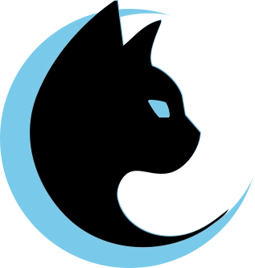

<div align="center">



# Luna

**Camera reports in your browser. Nothing leaves your device.**

Luna ingests camera media entirely client-side, extracts metadata and
thumbnails, and generates production-ready camera reports — no upload,
no install, no account.

[](LICENSE)


[Open Luna](https://luna.ozer2.one) · [Docs](https://luna.ozer2.one/docs) · [Disclaimer](DISCLAIMER.md)

</div>

---

## What Luna Does

Luna is built for DITs and camera assistants. Point it at a card or a folder
of clips — everything runs locally in the browser:

- Detects reels and groups clips per camera roll
- Extracts per-clip metadata (camera, lens, ISO, shutter, color space, frame rate, duration, …)
- Generates evenly-spaced thumbnails with accurate seeking
- Produces clean, sharable camera reports with PDF and CSV export
- Raw formats (ARRIRAW, BRAW, R3D, Canon RAW) get metadata-aware handling; generic
  codecs (ProRes, H.264/265, DNxHD, …) get the full decode pipeline

**Browser support:** Chromium-based browsers (Chrome, Edge, Arc, Brave) — Luna
relies on the File System Access API and WebCodecs.

## Repo Layout

Bun workspace:

| Path             | Package             | What it is                                          |
| ---------------- | ------------------- | --------------------------------------------------- |
| `apps/web`       | `@luna-web/app`     | The tool — Vite + React 19 + TanStack Router        |
| `apps/docs`      | `@luna-web/docs`    | Docs site — Astro Starlight                         |
| `apps/desktop`   | `@luna-web/desktop` | Tauri desktop shell wrapping apps/web               |
| `packages/core`  | `@luna-web/core`    | Pure logic: scanning, reels, metadata, report model |
| `tools/analysis` | —                   | Throwaway clip-analysis scripts                     |

## Develop

Requires [Bun](https://bun.sh) (package manager) and [Vite+](https://viteplus.dev/) (`vp` — build, test, lint, format, task runner).

```bash
vp install                          # installs via bun
bun run dev                         # run the app (vp dev)
bun --filter '@luna-web/docs' dev   # run the docs site (astro dev)
bun run test                        # package unit tests (Vitest via vp)
bun run test:tools                  # release-script tests (bun test)
vp check                            # format + lint + type check in one pass
bun run typecheck                   # authoritative tsc/astro type gates
bun run build                       # build everything (cached vp run)
```

`apps/desktop` additionally needs a Rust toolchain (stable-msvc) that no other workspace
requires; root `bun run dev` is filtered to `./apps/web` and deliberately doesn't start it —
run it from `apps/desktop` instead (`bun run dev`, once Rust is installed).

## Tech Stack

- [React 19](https://react.dev/) + [Vite](https://vite.dev/) + [TanStack Router/Store/Form](https://tanstack.com/)
- [Tailwind CSS 4](https://tailwindcss.com/) + [Base UI](https://base-ui.com/) + shadcn-style components
- [mediabunny](https://github.com/vanilagy/mediabunny) + WebCodecs — decode & thumbnails
- [mediainfo.js](https://mediainfo.js.org/) + [ffmpeg.wasm](https://ffmpegwasm.netlify.app/) — container/codec metadata
- [@react-pdf/renderer](https://react-pdf.org/) — PDF reports
- [Astro Starlight](https://starlight.astro.build/) — documentation site

## The Desktop App (retired)

This section is about the original .NET/Avalonia desktop app, not `apps/desktop`
(a separate, unreleased Tauri shell around the web app — see the Repo Layout table above).

Luna started life as a .NET/Avalonia desktop app. It has been retired in
favor of the web version and is preserved in full:

- Code: branch [`archive/dotnet`](https://github.com/shakedex/LunaApp/tree/archive/dotnet) / tag `dotnet-final`
- Installers: existing [releases](https://github.com/shakedex/LunaApp/releases) remain downloadable but receive no further updates

## Contributing

PRs welcome. File an issue first so the design can be discussed, and keep
changes scoped. By submitting a contribution, you agree it is licensed under
the same [Apache License 2.0](LICENSE) as the rest of the project.

## License

Luna is licensed under the [Apache License 2.0](LICENSE). See [NOTICE](NOTICE)
for required attribution. The name "Luna" and the logo are not licensed for
use in derivative branding.

## Trademarks & Disclaimer

Luna is an independent project and is **not affiliated with, endorsed by, or
sponsored by** ARRI, Blackmagic Design, Sony, or any other camera
manufacturer. All product names, logos, and brands are property of their
respective owners. See [DISCLAIMER.md](DISCLAIMER.md).

---

<div align="center">

Built by [Shaked Lipszyc](https://github.com/shakedex)

</div>
